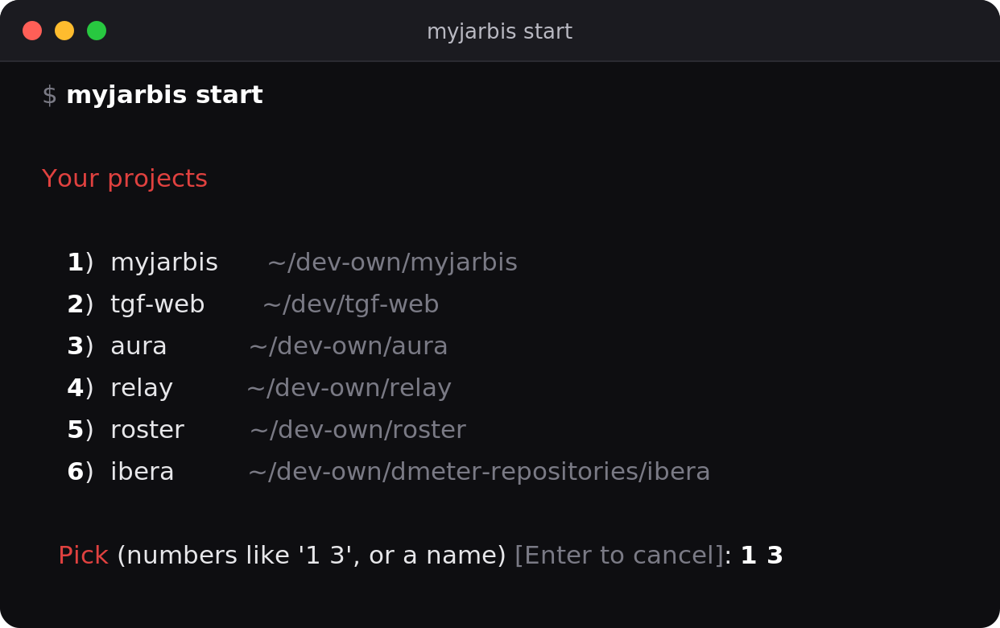
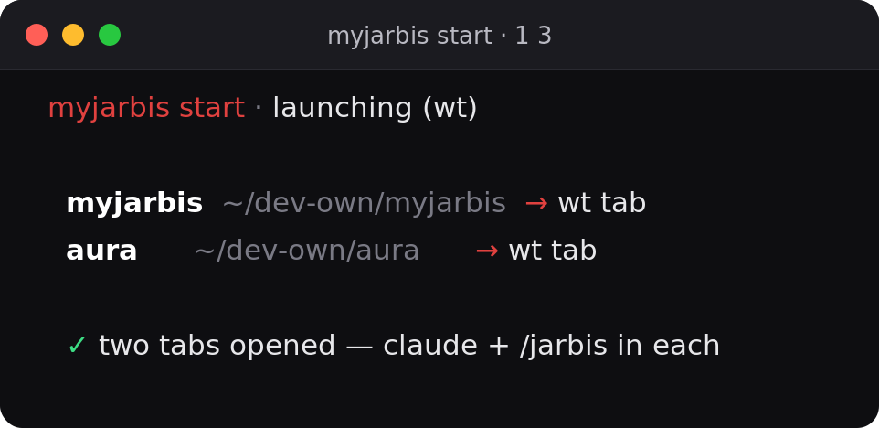
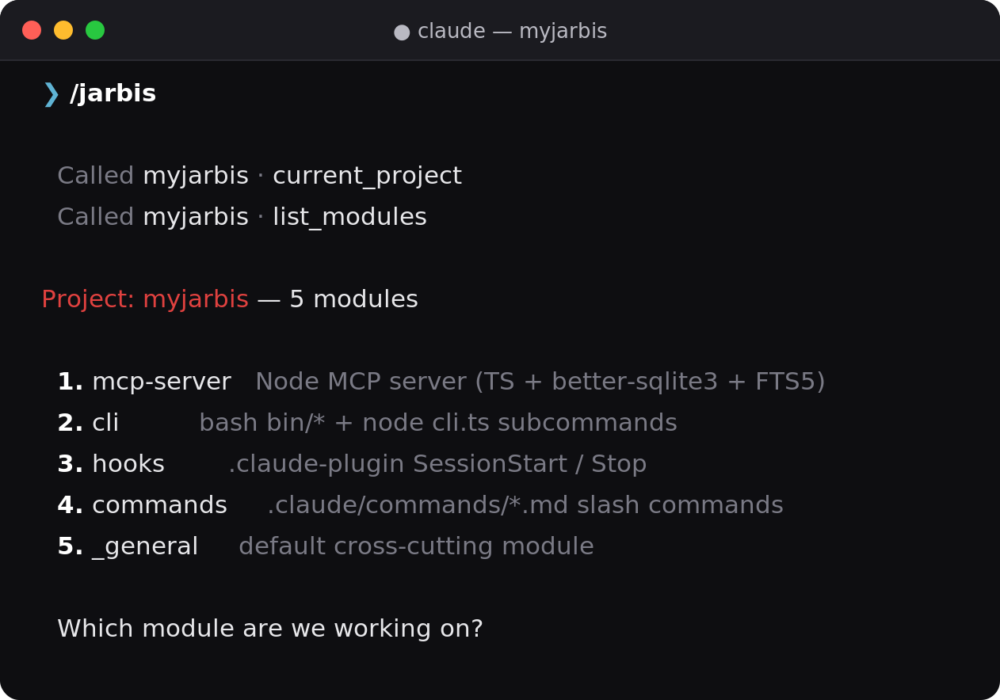
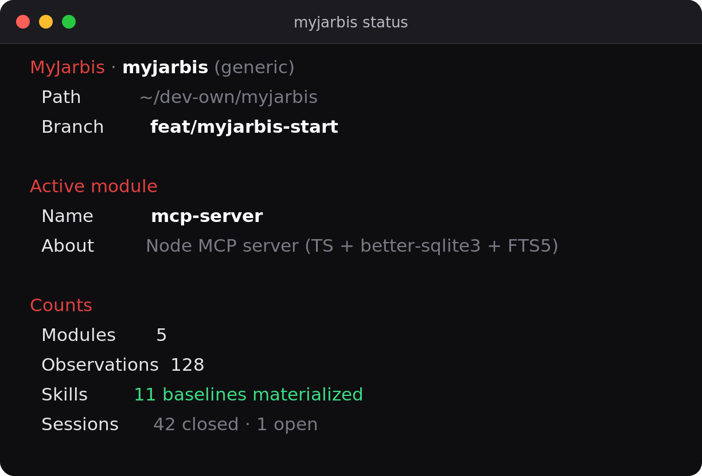

<h1 align="center">MyJarbis</h1>

<p align="center">
  <b>Persistent memory + per-project workflow + scoped skills for Claude Code.</b><br>
  One slash command. Everything else is a conversation.
</p>

<p align="center">
  
</p>

<p align="center">
  <i>Run <code>myjarbis start</code> from anywhere → pick a project → it opens a terminal already running Claude + <code>/jarbis</code>.</i>
</p>

---

## What it is

Claude Code has no project memory. You repeat conventions, re-explain
architecture, and lose "what was I doing yesterday."

**MyJarbis is a persistent-memory layer over MCP (Model Context
Protocol).** It turns Claude Code into a project-aware orchestrator that
remembers what you decided, where you left off, and which workflow
applies to each part of the project — without dumping everything into
context every session.

Every read/write goes through standard MCP tools + a local SQLite DB, so
**any MCP-compatible client** (Cursor, OpenClaw, future agents) can sit
on the same memory.

---

## Start in 30 seconds

```bash
# 1. install (once)
git clone https://github.com/braiantroncoso/myjarbis.git
cd myjarbis && ./install.sh

# 2. register a project (once per project)
cd ~/projects/my-app
myjarbis init

# 3. work — from anywhere, any day
myjarbis start
```

`myjarbis start` lists your projects, you pick one (or several), and it
opens a fresh terminal already `cd`'d in, with `claude` running and
`/jarbis` fired. No more `cd` → `claude` → `/jarbis` by hand.

<p align="center">
  
</p>

Prefer the classic way? It still works:

```bash
cd ~/projects/my-app
claude
> /jarbis
```

---

## See it work

`/jarbis` boots a session: it loads the project, lists your modules
(verticals), and resumes exactly where you left off.

<p align="center">
  
</p>

After that, **everything is natural language** — the agent knows which
MCP tool to call:

| You say…                                          | Agent does                                       |
|----------------------------------------------------|--------------------------------------------------|
| "let's work on AUTH-12"                            | search story + audit acceptance criteria + propose a phase |
| "I decided to use Laravel Sanctum"                 | `save_observation(kind=decision)`                |
| "heads up, refresh tokens must revoke access"      | `save_observation(kind=gotcha)`                  |
| "mark AUTH-12 done with commit abc"                | `update_progress` (row-level state)              |
| "commit this"                                      | git commit with a WHY / FOR-WHAT body, no signature |
| "let's switch to frontend"                         | confirm + `end_session` + `start_session(frontend)` |
| "where was I?"                                     | `resume()` — reads back the "Resume here"        |
| "done, close it"                                   | summary + `next_session` + `end_session`         |

The next `/jarbis` resumes right where this one ended.

The CLI is consistent and instant (zero LLM tokens) — here's `myjarbis status`:

<p align="center">
  
</p>

---

## Why per-project, per-module?

In real projects, work is **vertical**. You don't work on "the codebase";
you work on the Media Manager, then Page Builder, then Translations. Each
vertical has its own workflow, plan, stories, and skills.

MyJarbis models that explicitly — and **only loads the vertical you're in**:

```
project
  ├── project_context (practices, deps, conventions — always loaded)
  ├── modules (verticals — you create them)
  │     ├── module_context (workflow, plan, stories, AC)
  │     │     └── progress  (★ per-row state, like a "Smoke/Commit" column)
  │     ├── sessions (start → save observations → end)
  │     │     └── observations (decisions, gotchas, progress)
  │     └── skills (module-level — only when this module is active)
  └── skills (project-level — always loaded, the 10 baselines)
```

When you open Claude, the SessionStart hook asks which vertical you want.
**Only that module + the project core get loaded.** The other modules stay
out of context — that's the core token-saving move.

---

## `myjarbis start` — launch from anywhere

Run it from **any** directory. It reads your global registry, lets you
pick by number, name, or substring, and opens each chosen project ready
to work.

```bash
myjarbis start                 # interactive picker
myjarbis start aura            # by name (or substring) — skip the picker
myjarbis start                 # then type "1 3" to launch two at once
```

It **auto-detects** how to open each project (override with a flag):

| Environment             | Opens as                          | Force     |
|-------------------------|-----------------------------------|-----------|
| WSL + Windows Terminal  | a new `wt.exe` tab per project    | `--wt`    |
| inside a `tmux` session | a new tmux window per project     | `--tmux`  |
| otherwise               | replaces the current shell (one)  | `--here`  |

```bash
myjarbis start --print         # dry-run: print the resolved command(s), launch nothing
myjarbis start --no-jarbis     # open claude without firing /jarbis
myjarbis start --cmd "/resume" # custom initial prompt instead of /jarbis
myjarbis start --json          # list registered projects as JSON and exit
```

Projects whose path no longer exists are flagged `(path missing)` and
skipped. On WSL the tab is forced opaque (`--opacity 100`) so it doesn't
inherit a transparent profile. After you exit claude, the tab drops to a
shell in the project dir (keep-alive), so the window stays useful.

---

## CLI workflow (git-like)

`/jarbis` is fastest when it doesn't have to render a menu — it just
continues with what's set. The CLI handles setup and switching, like
`git checkout`, all instant and token-free:

```bash
myjarbis module use backend       # set active module (like git checkout)
myjarbis module current           # print active
myjarbis module unset             # clear → next /jarbis shows the menu

myjarbis status                   # git-like overview (project, module, counts)
myjarbis config list              # language, persona, scope, nudges
myjarbis config persona mentor    # change how the agent talks back
```

With an active module set, opening `claude` auto-resumes it and prints
the curated "Resume here" — `/jarbis` then only acknowledges and
continues (no tool calls, no menu render).

---

## Living diagrams

Documentation that **draws itself while you work.** Every module can get a
draw.io diagram that is a *view* of its memory — you never draw it by
hand. You code, you tell MyJarbis what you did (the `save_observation` you
already do), and the diagram redraws itself.

It reads top-to-bottom as a **narrative of the work**: one card per
observation — title, a kind tag, the "why", and the files it touched —
chained with arrows in the order things happened.

```text
        ┌───────────────────────────────────────────────┐
        │                  auth                          │   ← module banner
        └───────────────────────────────────────────────┘
                              │
        ┌───────────────────────────────────────────────┐
        │ Pick Sanctum over Passport                     │
        │ DECISION                                       │   ← kind tag
        │ Simpler token model, no OAuth server needed.   │   ← the "why"
        └───────────────────────────────────────────────┘
                              │
        ┌─[–]───────────────────────────────────────────┐
        │ AUTH-12 — Google OAuth callback                │
        │ DONE · validate id_token, link the local user  │
        │   ┌─────────────────────────────────────────┐  │
        │   │ GoogleAuthController.php · User.php      │  │   ← files nested,
        │   └─────────────────────────────────────────┘  │     full path on hover
        └───────────────────────────────────────────────┘
```

```bash
myjarbis diagram                # (re)generate + open the active module's diagram
myjarbis config diagram on      # opt in to auto-generate/open (default off)
```

It's **opt-in**: by default it only runs when you ask. Turn `diagram.auto`
on and session hooks + `save_observation` + `update_progress` keep it live
and pop it open in VS Code (install the
[Draw.io Integration](https://marketplace.visualstudio.com/items?itemName=hediet.vscode-drawio)
extension to render `.drawio` inside the editor).

---

## Deep dive

<details>
<summary><b>Bootstrap a project (init, modules, importing your .md files)</b></summary>

```bash
cd ~/projects/my-app
myjarbis init                          # creates memory.db + 10 baselines + plugin hooks
```

`myjarbis init` is **interactive** — it asks two questions to personalize
how Claude talks back:

```
Languages: EN (United States), ES (Argentina), PT (Brazil)
  Language [EN/es/pt]: en

Personas:
  1=Concise (token-saving) — terse, no preamble (default)
  2=Pair programmer — 1-line intent before each change
  3=Mentor — WHAT/WHY/HOW/BENEFITS
  4=Critical reviewer — challenges your assumptions first
  Persona [1/2/3/4, default 1]: 1
```

Skip the prompts for CI / scripts:

```bash
MYJARBIS_LANGUAGE=ES MYJARBIS_PERSONA=concise myjarbis init
```

Create your verticals and import the `.md` files you already keep on disk:

```bash
myjarbis module add backend
myjarbis module add frontend

myjarbis import agents/WORKFLOW.md         --target=project        --kind=workflow
myjarbis import agents/backend/PLAN.md     --target=module:backend --kind=plan
myjarbis import agents/backend/Jira.json   --target=module:backend --kind=story --mapping='stories[]'
```

Re-imports are **idempotent** (SHA-256 on content): unchanged → no-op,
changed → in-place UPDATE.

</details>

<details>
<summary><b>The daily flow + the SessionStart menu</b></summary>

```bash
cd ~/projects/my-app
claude
> /jarbis
```

The SessionStart hook fires:

```
═══ MyJarbis · my-app (laravel) ═══

Modules:
  • backend, last session 2026-05-04 14:30 UTC
  • frontend (paused)

Pick a module to begin (e.g., "let's work on backend").
Or create a new one: `myjarbis module add <name>`.

── Last "Retomar aquí" (backend, 2026-05-04 14:30 UTC) ──
PR #1234 merged to develop. Next: start AUTH-12 with the JWT
refresh flow. Branch: feature/auth-12-refresh-jwt.
```

The menu **always shows** — even with one module — so you can switch
verticals, create one, or change settings without leaving Claude.
Timestamps are absolute ISO (not "2h ago"), so the output is byte-stable
and Anthropic's prompt cache survives between calls.

You say *"let's work on backend"* → the agent calls
`start_session("backend")` and gets project_core + backend context + the
previous `next_session`. Only the 10 baselines + backend's module-level
skills are materialized to `.claude/skills/`. Frontend's are not on disk.

</details>

<details>
<summary><b>Per-row state — the <code>progress</code> field</b></summary>

Hand-edited PROGRESS.md tables have a "Smoke" column, a "Commit" column, a
"Status" column — **per-row state**. MyJarbis ships the same primitive:
every `module_context` row (typically a story) has a free-form markdown
`progress` field the agent maintains:

```
"mark MM-S3.6 as done with commit abc1234, smoke OK"
  ↓
update_progress(
  local_id = "MM-S3.6",
  progress = "✅ done batch 2 (2026-05-04) · commit abc1234 · smoke OK"
)
```

The `progress` text travels with the row in `start_session`, `search`, and
`load_module` — so the next `/jarbis` already sees which stories are done,
in progress, or blocked, without reading any MD.

| MD workflow                            | MyJarbis equivalent                          |
|----------------------------------------|----------------------------------------------|
| Edit PROGRESS.md "Smoke" column        | `update_progress(local_id, "✅ done · ...")` |
| Edit CURRENT.md rolling summary        | `end_session(summary, next_session)`         |
| Edit ERRORS.md new lesson              | `save_observation(kind=gotcha, ...)`         |
| Read CURRENT.md next morning           | `previousSession.nextSession` in `start_session` |

</details>

<details>
<summary><b>RAG-style context loading (how it stays cheap)</b></summary>

`start_session` does **not** dump the full module library. It returns:

- `previousSession.nextSession` — the curated "Resume here" (read first)
- `projectContext[]` / `moduleContext[]` — index entries (title + 240-char
  excerpt + `progress` flag)
- `stories: { count, entries: [{localId, progress?}] }` — inventory, no body

When the agent needs a full row, it follows the canonical RAG pattern:

```
1. search(query, scope="module")     # FTS5 snippets with row IDs
2. load_module(row_ids=[<id>])       # full body of just those rows
```

`load_module` returns **excerpts by default**; `full=true` is opt-in and
warns past 50KB — so the agent never accidentally loads 100KB+ of docs
into one call.

</details>

<details>
<summary><b>The 10 baseline skills</b></summary>

Materialized to `.claude/skills/myjarbis-<name>/SKILL.md` and loaded at
session start:

| Skill                  | What it teaches the agent                                    |
|------------------------|--------------------------------------------------------------|
| `module-orchestration` | How to pick/switch modules + conversational triggers         |
| `session-protocol`     | When to close a session + summary + next_session format      |
| `observation-protocol` | When to save decision/gotcha/progress + natural triggers     |
| `story-driven`         | Pipeline detect → audit → execute → close, by phases         |
| `bitacora-progress`    | How to write a "next_session" that helps tomorrow            |
| `framework-detect`     | Auto-explore the codebase on the first session               |
| `subagent-delegation`  | When to spawn Explore/Plan/general-purpose in parallel       |
| `compact-protocol`     | Structured snapshot before native `/compact`                 |
| `interaction-style`    | Your tone / language / depth (composed at init)              |
| `commit-hygiene`       | Commit format + git log as queryable context                 |

**`commit-hygiene`** — every commit follows `type(scope): description`
with a `Por qué:` / `Para qué:` body, no `Co-Authored-By: Claude`, no
`--no-verify`, no `git add -A`. The git log becomes queryable memory.

**`interaction-style`** — composed from your language + 1 of 4 personas
(Concise / Pair programmer / Mentor / Critical reviewer). Re-edit anytime
with `myjarbis skill edit interaction-style`.

</details>

<details>
<summary><b>Custom skills (project- or module-level)</b></summary>

```bash
# project-level (always active here)
myjarbis skill add jira-rules --content-from=docs/jira-rules.md \
  --description="JIRA tracking rules for this project"

# module-level (only active when working on MM)
myjarbis skill add mm-pixel-perfect --module=MM \
  --content-from=docs/mm-pixel-perfect.md \
  --description="MM: copy HTML from design package, never reinterpret"
```

When you `start_session(MM)`, MM's skills materialize to `.claude/skills/`.
Switch modules and they disappear; the new module's appear.

</details>

<details>
<summary><b>What the hooks do automatically</b></summary>

`.claude-plugin/hooks/hooks.json` registers 4 events:

- **SessionStart (startup|clear)** — if `.myjarbis/active` is set,
  auto-starts that module and prints the curated `next_session` (no menu).
  Otherwise prints the localized module menu. Output is byte-stable.
- **SessionStart (compact)** — restores the pre-compact snapshot.
- **UserPromptSubmit** — first message forces ToolSearch + detects story
  localIds. Optional save reminder via `nudges.save_reminder_minutes`.
- **Stop** — reminds you to close an open session.

**Optional git `post-commit` hook** (`myjarbis hook install git-post-commit`):
on every commit while a session is open, saves a `progress` observation
with the hash, message, files, and detected story id. Idempotent.

**Stale-resume warning** — when the "Resume here" is older than 7 days
(`session.stale_after_days`), the hook surfaces a warning to confirm the
context still applies before the agent proceeds.

</details>

<details>
<summary><b>Architecture</b></summary>

```
┌─────────────────────────────────────────────────────────────────┐
│  CLAUDE CODE (harness)                                           │
│  • hooks  • /jarbis (only one)  • skills loaded from .claude/    │
└────────────────────────────────┬────────────────────────────────┘
                                 ▼
┌─────────────────────────────────────────────────────────────────┐
│  MCP SERVER (Node/TS, ~/.myjarbis-global/mcp-server/)            │
│  Always-loaded: current_project, list_modules, start/end_session,│
│    resume, load_project_core, load_module, search,               │
│    save_observation, update_progress                             │
│  Deferred (ToolSearch): create_module, *_skills, import_*,       │
│    set_interaction_style, search_code, get_context, update_memory│
└────────────────────────────────┬────────────────────────────────┘
                                 ▼
┌─────────────────────────────────────────────────────────────────┐
│  SQLite (.myjarbis/memory.db) — better-sqlite3 + FTS5            │
│  projects → project_context · modules · skills                   │
│  modules → module_context · sessions → observations              │
└─────────────────────────────────────────────────────────────────┘
```

Each project has its own `memory.db`. `shared: true` commits it to the
repo (whole team loads the same context — `init --shared=true` warns that
observations may carry tokens/paths). `shared: false` (default) is
`.gitignore`d and personal.

</details>

<details>
<summary><b>Token economy + <code>myjarbis cost</code></b></summary>

Five levers keep token use low:

1. **Per-module loading** — only the active module + project core ride the
   system prompt.
2. **Index by default** — `start_session` / `load_module` return excerpts;
   full bodies arrive only via `load_module(row_ids=[...])` after a search.
3. **Cache-stable hooks** — byte-deterministic output so the prompt cache
   survives between turns.
4. **Deferred admin tools** — 9 of 18 MCP tools load on demand
   (~600–1200 tokens saved/session).
5. **Trilingual `/jarbis`** — each project loads only its language variant.

```bash
myjarbis cost                  # tokens + cache hit ratio per session, USD approx
myjarbis cost --last=5 --json
```

Hit ratio above ~80% means the cache is working; below ~50% means
something is emitting variable content and busting it.

</details>

<details>
<summary><b>Scoped search</b></summary>

`search` is FTS5 over project_context, module_context, skills, and
observations. Scopes:

- `module` (default) — active module + project_core. **Token-saving.**
- `project` — every module of this project + project_core
- `module_only` — only the active or named module
- `observations` — only the session log
- `skills` — only skill content

With 5 modules indexed, the default `module` scope means the agent only
sees hits from the one you're in.

</details>

<details>
<summary><b>Migrations</b></summary>

**v0.1 → v0.2** (markdown → SQLite) runs automatically on first open:
`knowledge-base.md` → observations, `daily.md` → workflow,
`project-summary.md` → functional spec, 10 baselines seeded. Auto-backup
at `~/.myjarbis-global/backups/<project>/<ts>/`. Legacy aliases
(`search_code`, `get_context`, `update_memory`) still work.

**Schema versioning** — `MyJarbisDB.open()` walks `MIGRATIONS[v]` from
current+1 up to `SCHEMA_VERSION`; each step is idempotent. v3 added
`module_context.progress` and upgrades any v2 DB in place.

</details>

<details>
<summary><b>Full Bash CLI reference</b></summary>

```bash
myjarbis init                       # init project (interactive)
myjarbis start [name] [flags]       # global launcher (see above)
myjarbis doctor                     # health check (25+ probes)
myjarbis status [--json]            # git-like overview
myjarbis timeline <module> [--json --limit=N]
myjarbis stats                      # row counts per table
myjarbis cost [--last=N] [--json]   # token usage + cache hit ratio
myjarbis list                       # registered projects
myjarbis update                     # pull + rebuild MCP server
myjarbis hook install git-post-commit

myjarbis module list | use <n> | current | unset | add <n> [--description=...]
myjarbis config list | language <EN|ES|PT> | persona <concise|pair|mentor|reviewer>
myjarbis config diagram <on|off>

myjarbis skill add <name> --content-from=<file> [--module=...] [--description=...]
myjarbis skill list | edit | delete | enable | disable | materialize

myjarbis import <file.md>   --target=<project|module:NAME> --kind=<kind>
myjarbis import <file.json> --target=... --kind=<kind> --mapping='items[]'
```

</details>

<details>
<summary><b>Per-project settings (<code>.myjarbis/config/settings.json</code>)</b></summary>

```json
{
  "version": "0.2.0",
  "project": { "name": "my-app", "framework": "laravel" },
  "shared": false,
  "search_default_scope": "module",
  "story_pattern": "[A-Z]+-S?\\d+(\\.\\d+)?",
  "auto_module_select_when_single": true,
  "skills": {
    "materialize_on_session_start": true,
    "cleanup_module_skills_on_session_end": false
  },
  "nudges": { "save_reminder_minutes": null },
  "session": { "stale_after_days": 7 },
  "diagram": { "auto": false }
}
```

- `nudges.save_reminder_minutes` — positive integer N reminds the agent to
  `save_observation` after N+ idle minutes; `null` keeps hooks cache-stable.
- `diagram.auto` — opt-in living diagram. `false` = only `myjarbis diagram`
  generates/opens it; `true` = session hooks keep it live in VS Code.

</details>

<details>
<summary><b>Tests</b></summary>

```bash
tests/bootstrap-import.sh      # 12 .md + 1 JSON bulk import idempotency
tests/skills-lifecycle.sh      # baselines + module-level + cleanup on switch
tests/full-session-cycle.sh    # open → work → close → reopen → resume
tests/compact-cycle.sh         # snapshot pre/post /compact roundtrip
tests/dx-batch-1.sh            # stale-resume + timeline + post-commit auto-observation
```

</details>

---

<p align="center">
  <b>The single slash command is <code>/jarbis</code>.</b> Everything else is conversation or a quick CLI verb.<br>
  No <code>/plan</code>, <code>/implement</code>, <code>/complete</code> — the 10 baseline skills let the agent infer all of it.
</p>

<p align="center">
  MIT · Built by Braian Axel Troncoso 🇦🇷
</p>
